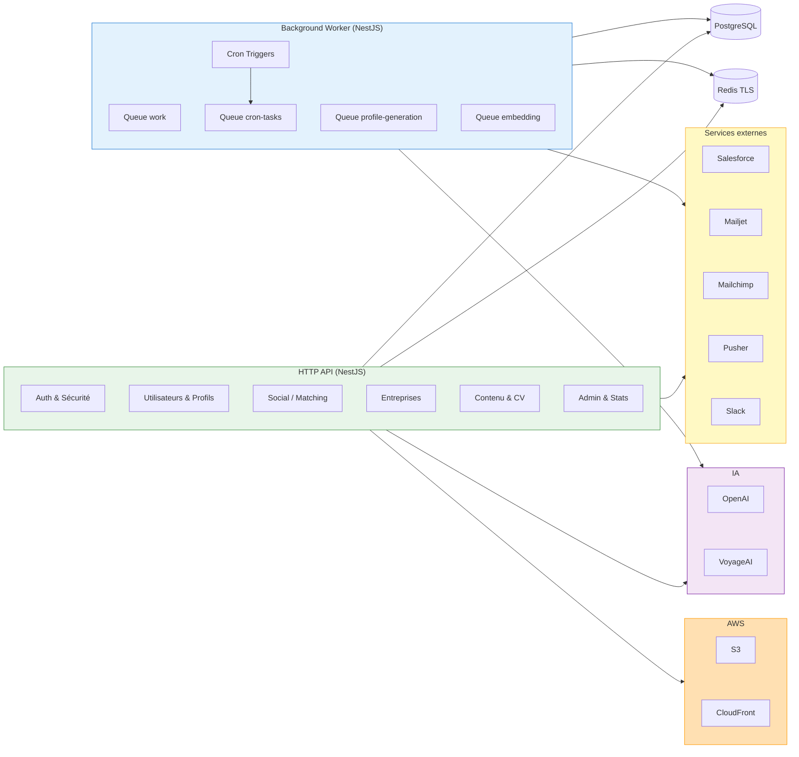
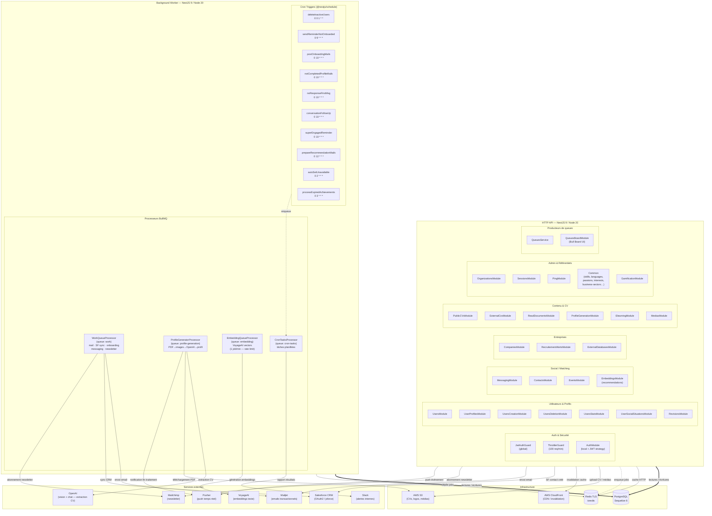

# Architecture technique — entourage-job-back

API REST NestJS pour la plateforme EntourageApp, orchestrant la mise en relation professionnelle entre candidats et coachs.

---

## Aperçu simplifié

---

## Vue d'ensemble détaillée

---

## Queues BullMQ

| Queue | Job | Processeur | Description |
|-------|-----|------------|-------------|
| `work` | `send_mail` | `WorkQueueProcessor` | Envoie un ou plusieurs emails via Mailjet |
| `work` | `newsletter_subscription` | `WorkQueueProcessor` | Inscrit un contact à la newsletter (Mailjet/Mailchimp) |
| `work` | `create_or_update_salesforce_user` | `WorkQueueProcessor` | Crée ou met à jour un utilisateur dans Salesforce CRM |
| `work` | `create_or_update_salesforce_company` | `WorkQueueProcessor` | Crée ou met à jour une entreprise dans Salesforce CRM |
| `work` | `update_salesforce_user_company` | `WorkQueueProcessor` | Met à jour l'entreprise associée à un utilisateur dans Salesforce |
| `work` | `on_onboarding_completed` | `WorkQueueProcessor` | Post-onboarding : envoi message de bienvenue staff + mail recommandations |
| `work` | `send_staff_messaging_message` | `WorkQueueProcessor` | Envoie un message de messagerie interne depuis un contact staff |
| `work` | `bulk_send_staff_messaging_message` | `WorkQueueProcessor` | Envoi en masse de messages staff (décomposé en jobs individuels) |
| `profile-generation` | `generate_profile_from_pdf` | `ProfileGeneratorProcessor` | Télécharge le PDF depuis S3, convertit en images, extrait le CV via OpenAI Vision, hydrate le profil utilisateur |
| `embedding` | `update_user_profile_embeddings` | `EmbeddingQueueProcessor` | Calcule les vecteurs VoyageAI pour un profil utilisateur (1 job/min) |
| `embedding` | `update_user_profile_embeddings_batch` | `EmbeddingQueueProcessor` | Calcule les vecteurs VoyageAI pour un lot d'utilisateurs |
| `cron-tasks` | `delete_inactive_users` | `CronTasksProcessor` | Supprime les utilisateurs inactifs depuis trop longtemps |
| `cron-tasks` | `send_reminder_to_user_not_completed_onboarding` | `CronTasksProcessor` | Relance les utilisateurs n'ayant pas finalisé l'onboarding (J+3) |
| `cron-tasks` | `prepare_post_onboarding_completion_mails` | `CronTasksProcessor` | Emails post-onboarding : BAO (J+1), conseils contact (J+4) |
| `cron-tasks` | `prepare_not_completed_profile_mails` | `CronTasksProcessor` | Rappel de complétion de profil (J+5 après onboarding) |
| `cron-tasks` | `prepare_user_without_response_to_first_message_mails` | `CronTasksProcessor` | Rappel si aucune réponse au premier message (J+5) |
| `cron-tasks` | `prepare_user_conversation_follow_up_mails` | `CronTasksProcessor` | Suivi des conversations avec réponses mutuelles (J+15) |
| `cron-tasks` | `prepare_recommendation_mails` | `CronTasksProcessor` | Emails de recommandations IA pour utilisateurs inactifs (J+10/20/30) |
| `cron-tasks` | `prepare_auto_set_unavailable_users` | `CronTasksProcessor` | Passe en indisponible les utilisateurs inactifs avec messages non lus |
| `cron-tasks` | `process_expired_achievements` | `CronTasksProcessor` | Renouvelle ou expire les badges gamification échus |
| `cron-tasks` | `prepare_super_engaged_achievement_reminder_mails` | `CronTasksProcessor` | Rappel aux coachs dont le badge "Super Engagé" expire dans 30 jours |

---

## Tâches planifiées (Cron)

| Méthode | Schedule | Heure UTC | Description |
|---------|----------|-----------|-------------|
| `deleteInactiveUsers` | `0 0 1 * *` | 1er du mois, 00:00 | Supprime les comptes inactifs depuis trop longtemps |
| `sendReminderToUserNotCompletedOnboarding` | `0 9 * * *` | 09:00 quotidien | Relance les utilisateurs qui n'ont pas finalisé l'onboarding (J+3) |
| `preparePostOnboardingCompletionMails` | `0 10 * * *` | 10:00 quotidien | Emails post-onboarding cycle relationnel (BAO J+1, conseils J+4) |
| `prepareNotCompletedProfileMails` | `0 10 * * *` | 10:00 quotidien | Rappel de complétion de profil (J+5 après onboarding) |
| `prepareUserWithoutResponseToFirstMessageMails` | `0 10 * * *` | 10:00 quotidien | Rappel si aucune réponse au premier message (J+5) |
| `prepareUserConversationFollowUpMails` | `0 10 * * *` | 10:00 quotidien | Suivi des conversations avec réponses mutuelles (J+15) |
| `prepareSuperEngagedAchievementReminderMails` | `0 10 * * *` | 10:00 quotidien | Rappel badge "Super Engagé" expirant dans 30 jours |
| `prepareRecommendationMails` | `0 12 * * *` | 12:00 quotidien | Emails de recommandations IA (utilisateurs inactifs J+10/20/30) |
| `prepareAutoSetUnavailableUsers` | `0 2 * * *` | 02:00 quotidien | Passe en indisponible les inactifs avec messages non lus (60j sans connexion) |
| `processExpiredAchievements` | `0 3 * * *` | 03:00 quotidien | Renouvelle ou expire les badges gamification échus |

---

## Services externes

| Service | Rôle | Authentification | Utilisé par (module) |
|---------|------|-----------------|----------------------|
| **AWS S3** | Stockage de fichiers (CVs, logos, médias) | Access Key / Secret Key (env) | `MediasModule`, `ExternalCvsModule`, `ProfileGeneratorProcessor` |
| **AWS CloudFront** | CDN et invalidation de cache | Clé privée CloudFront (env) | `MediasModule` |
| **OpenAI** | Extraction de CV par vision (PDF → données structurées) | API Key (env) | `ProfileGeneratorProcessor`, `ReadDocumentsModule` |
| **VoyageAI** | Génération d'embeddings texte pour le matching | API Key (env) | `EmbeddingQueueProcessor`, `EmbeddingsModule` |
| **Salesforce** | CRM — synchronisation utilisateurs et entreprises | OAuth2 / jsforce (env) | `WorkQueueProcessor`, `SalesforceModule` |
| **Mailjet** | Envoi d'emails transactionnels par template | API Key + Secret (env) | `WorkQueueProcessor`, `MailsModule` |
| **Mailchimp** | Gestion des abonnements newsletter | API Key (env) | `WorkQueueProcessor`, `MailsModule` |
| **Pusher** | Notifications push temps réel vers le frontend | App ID + Key + Secret (env) | `ProfileGeneratorProcessor`, modules temps réel |
| **Slack** | Alertes internes de monitoring cron | Webhook / Bot Token (env) | `CronTasksSlackReporterService` |
| **PostgreSQL** | Base de données principale | URI (`DATABASE_URL`) | Tous les modules via Sequelize |
| **Redis (TLS)** | File BullMQ + cache HTTP | URI (`REDIS_TLS_URL` / `REDIS_URL`) | BullMQ, CacheModule, tous les modules |

---

## Infrastructure

- **Runtime** : Node.js 20.x
- **Framework** : NestJS 9.4.x (TypeScript strict)
- **Processus** : deux processus indépendants
  - **HTTP API** (`src/main.ts`) — expose les routes REST, applique les guards JWT + Throttler
  - **Background Worker** (`src/worker.ts`) — consomme les queues BullMQ et exécute les crons
- **Base de données** : PostgreSQL via Sequelize 6 + sequelize-typescript ; migrations dans `db/migrations/`
- **Cache** : Redis (TLS) via `ioredis` + `cache-manager-ioredis` (partagé entre API et Worker)
- **Queue engine** : BullMQ 5 — 4 queues nommées (`work`, `profile-generation`, `embedding`, `cron-tasks`) ; Redis comme backing store
- **Priorités de queue** : `HIGH=1`, `NORMAL=10`, `LOW=100` (plus la valeur est basse, plus la priorité est haute)
- **Cron** : `@nestjs/schedule` (node-cron), tourne uniquement dans le processus Worker
- **IA** : OpenAI SDK v4 (vision + chat), VoyageAI SDK — traitements asynchrones via queues dédiées
- **Monitoring** : Datadog APM (`dd-trace`) initialisé dans `src/tracer.ts`
- **Auth** : JWT (passport-jwt) + stratégie locale ; guard API-key pour les endpoints worker
- **Rate limiting** : ThrottlerGuard global — 100 requêtes / 60 s
- **Secrets** : variables d'environnement (`.env` local / config vars Heroku en production)
- **Package manager** : yarn 1.22.x
- **Build** : NestJS CLI (webpack + ts-loader) — configs séparées pour API (`nest-cli.json`) et Worker (`nest-cli.worker.json`)
- **Bull Board** : interface de monitoring des queues, activée si `QUEUES_ADMIN_PASSWORD` est défini
